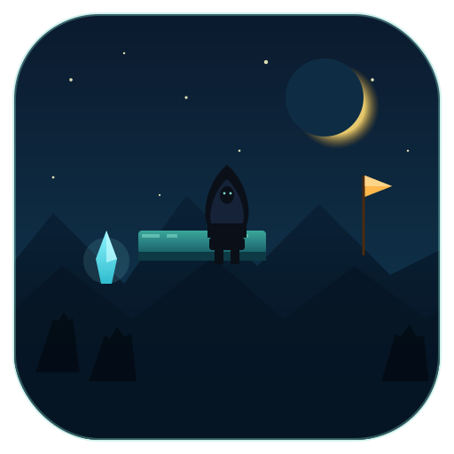

<div align="center">
  

  <p><strong>Side-scroller platformer speedrun-friendly, en Rust avec Bevy 0.14.</strong></p>

  <p>
    <a href="https://github.com/pedrokarim/adventure-timing/actions/workflows/ci.yml">
      
    </a>
    <a href="LICENSE">
      
    </a>
    
    
    <a href="https://pedrokarim.github.io/adventure-timing/">
      
    </a>
  </p>
</div>

---

## Sommaire

- [Jouer](#jouer)
- [Contrôles](#contrôles)
- [Niveau](#niveau)
- [Direction artistique](#direction-artistique)
- [Features](#features)
- [Build pour distribution](#build-pour-distribution)
- [Régénérer les assets](#régénérer-les-assets)
- [Documentation](#documentation)
- [Contribuer](#contribuer)
- [Licence](#licence)

## Jouer

```bash
cargo run --release   # build optimisé, recommandé pour tester le feel
cargo run             # build dev rapide après la première compilation
```

## Contrôles

| Action | Touche |
|---|---|
| Gauche / Droite | `Q D` ou `← →` |
| Saut | `Espace`, `W` ou `↑` |
| Pause | `Échap` |
| Menu (depuis pause/fin) | `Q` |

Le saut est variable : tap court = petit saut, maintenir = saut haut.
Coyote time (100 ms) et jump buffer (120 ms) intégrés.

## Niveau

Un niveau de test traverse 5 sections : zone d'échauffement, escaliers
de plateformes, passage avec pics blancs (mortels), ascension verticale
contre un mur, puis trois piliers étroits avant le drapeau rose.

- Les **drapeaux jaunes** sont des checkpoints (deviennent verts au passage).
- Les **pics blancs** tuent au contact, respawn au dernier checkpoint.
- Tomber sous le niveau = mort.
- Le **drapeau rose** termine le niveau et affiche le temps + le nombre
  de morts.

## Direction artistique

Palette **nuit mystique** : dominantes teal / bleu nuit, silhouettes
encapuchonnées, accents cyan (cristaux) et ambre (cœur du goal). Forêt
en silhouette, étoiles, montagnes.

<div align="center">
  
</div>

## Features

- Contrôleur platformer kinematic complet (coyote, buffer, saut variable)
- Collisions AABB axe par axe contre solides statiques
- États du jeu : menu principal, jeu, pause, game over, victoire
- Checkpoints, hazards, drapeau de fin
- HUD compteur de morts + temps écoulé
- Squash & stretch du joueur (saut, atterrissage, chute)
- Screen shake à l'atterrissage et à la mort
- Particules de poussière au saut et à l'atterrissage
- Caméra qui suit avec lookahead et lerp framerate-indépendant
- Sprites pixel art **procéduraux** (joueur 7 frames animées, tiles,
  pics, drapeaux) générés par `cargo run --example gen_assets`
- SFX procéduraux (saut, atterrissage, mort, checkpoint, victoire)
- Musique procédurale par niveau (`cargo run --example gen_music`)
- Sauvegarde persistante (`~/.local/share/adventure_timing/`) :
  meilleur temps, moins de morts, runs complétées, héros choisi,
  progression sur la carte
- Menu principal interactif (clavier + souris + manette via `bevy_gilrs`)
- Écrans Paramètres (plein écran + 3 volumes) et Crédits
- Tutoriel jouable sur map dédiée
- Carte du voyage (level select stylé bois clouté)
- 5 throwables + 3 armes (HUD arme dédié)

## Build pour distribution

### Linux (build local optimisé)

```bash
cargo build --release        # binaire dans target/release/adventure_timing
# ou plus rapide pour itérer :
cargo build --profile release-fast
```

Le binaire est statique pour son code, mais a besoin des `assets/` à
côté (chemin relatif `./assets/`). Pour redistribuer : zip le binaire +
le dossier `assets/`.

### Windows / macOS via `cross`

```bash
cargo install cross --git https://github.com/cross-rs/cross
cross build --release --target x86_64-pc-windows-gnu
cross build --release --target x86_64-apple-darwin
```

### WASM (itch.io / page web)

Le portage WASM demande de conditionner `save.rs` sur `localStorage`
(la crate `directories` + `std::fs` ne sont pas disponibles en
`wasm32-unknown-unknown`) et de désactiver `dynamic_linking` pour la
cible WASM. Piste :

```bash
rustup target add wasm32-unknown-unknown
cargo install -f wasm-bindgen-cli
cargo build --release --target wasm32-unknown-unknown --no-default-features
wasm-bindgen --no-typescript --target web \
    --out-dir wasm \
    --out-name "adventure_timing" \
    target/wasm32-unknown-unknown/release/adventure_timing.wasm
```

Un déploiement Pages jouable arrivera dans une version ultérieure.

### Profils Cargo

- `release` : LTO fat + strip + panic=abort. Binaire minimal mais build
  lent (~3-5 min).
- `release-fast` : LTO thin sans strip. Pour itérer sur les builds
  release (~1-2 min).

## Régénérer les assets

Tous les sprites, SFX et musiques sont générés par des binaires
dédiés, pas de fichier binaire commité « à la main » :

```bash
cargo run --example gen_assets   # sprites pixel art -> assets/sprites/
cargo run --example gen_audio    # SFX WAV procéduraux
cargo run --example gen_music    # pistes musicales
```

## Documentation

- [Choix du moteur](docs/01-choix-moteur.md) — Bevy vs Macroquad vs ggez
- [Stack technique](docs/02-stack.md) — physique, audio, assets, tiles
- [Architecture](docs/03-architecture.md) — organisation du code et ECS
- [Roadmap](docs/04-roadmap.md) — étapes de développement
- [Getting started](docs/05-getting-started.md) — premier prototype

## Contribuer

Les contributions sont bienvenues : lis
[`CONTRIBUTING.md`](CONTRIBUTING.md) pour l'organisation du repo, le
style de commits et le workflow PR. On respecte le
[Code of Conduct](CODE_OF_CONDUCT.md).

Pour rapporter un bug : [ouvre une issue](https://github.com/pedrokarim/adventure-timing/issues/new/choose).

## Licence

MIT — voir [`LICENSE`](LICENSE).
